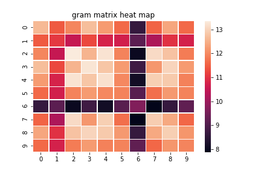
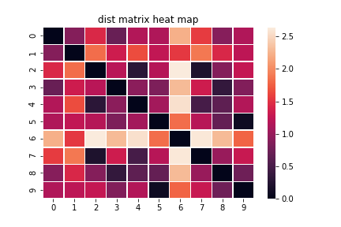
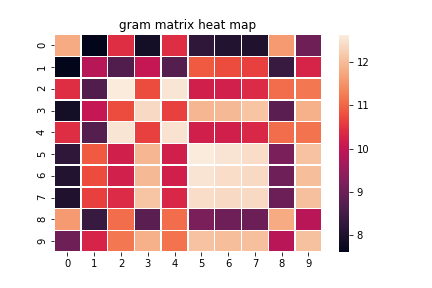
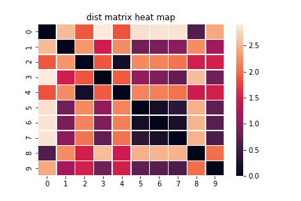
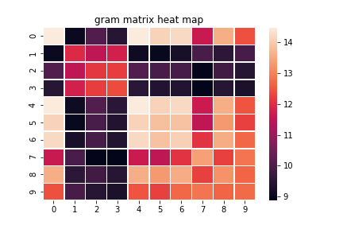
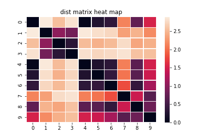

## Gram matrix heat map:
#### Graph2: sampled 10 nodes, 16 dim

std: 1.5064409

mean: 11.396629

## Dist matrix heat map:
#### Graph2: sampled 10 nodes, 16 dim

std: 0.7021413

mean:1.1424968

## Gram matrix heat map:
#### Graph21: sampled 10 nodes, 16 dim

std: 1.4575126

mean: 10.549004

## Dist matrix heat map:
#### Graph21: sampled 10 nodes, 16 dim

std: 0.9128894

mean: 1.4793445

## Gram matrix heat map:
#### Graph11: sampled 10 nodes, 16 dim

std: 1.8766881

mean: 11.497501

## Dist matrix heat map:
#### Graph11: sampled 10 nodes, 16 dim

std: 1.0513314

mean: 1.5662838