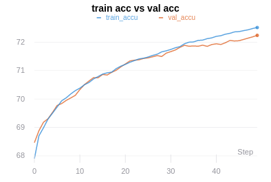
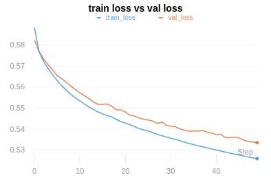

## GCN node classification Hyper parametere tuning

### Parameters tuned:
- Learning rate
- No. of GCN layers(hidden layers)
- Number of hidden dimensions

### Code:
- [Link](https://github.com/anilesec/gcn_node_classification)

### All Logs:
- [Link1](https://app.wandb.ai/aniles-ec/gcn_node_classification_hype_2?workspace=user-aniles-ec)
    * Logs of total 288 combinations
- [Link2](https://app.wandb.ai/aniles-ec/gcn_node_classification_hype?workspace=user-aniles-ec)
    * Logs of sampled 16 combinations

### Best combination result:
- [Link](https://app.wandb.ai/aniles-ec/gcn_node_classification_hype_2/runs/ilbagz15?workspace=user-aniles-ec)
    
    * Plots of accuracy, loss, and gradients/parameters

#### Accuracy plot:

*x-axis: epochs, y-axis: accuracy in %*

#### Loss plot:

*x-axis: epochs, y-axis: loss(negative log likelihood)*

#### Results:

|          | Training | Validation |
|:--------:|:--------:|:----------:|
| **Accuracy** |  72.516% |   72.239%  |
|   **Loss**   |   0.526  |   0.5336   |

#### Hyperparameters:

    learning rate: 0.0005
    epochs: 50
    hid_layer_dim: 128
    no_hid_layers(gcn): 2

