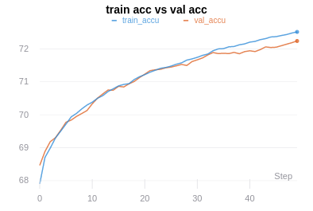
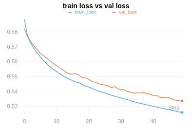
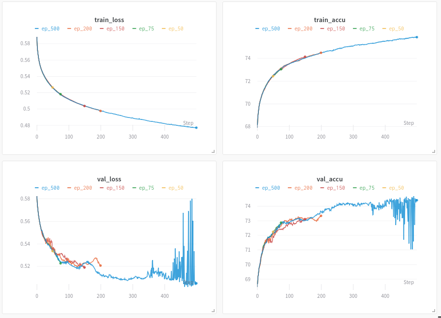
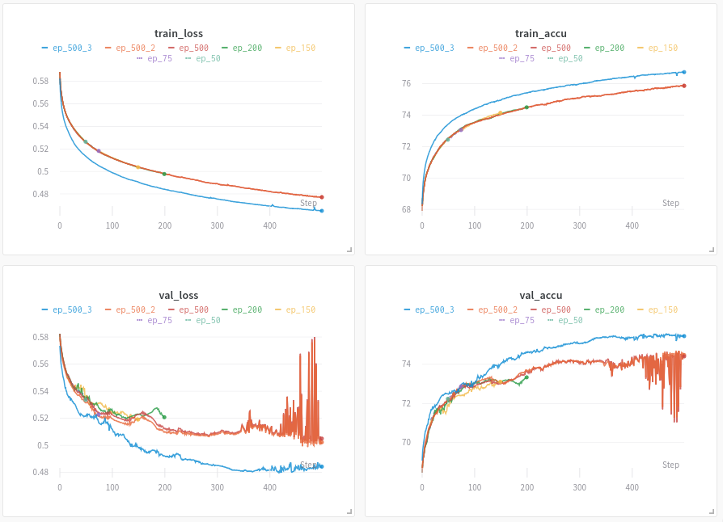

## GCN node classification hyperparameter tuning

### Parameters tuned:
- Learning rate
- No. of GCN layers(hidden layers)
- Number of hidden dimensions

### Code:
- [Link](https://github.com/anilesec/gcn_node_classification)
    * Repository

### All Logs:
- [Link1](https://app.wandb.ai/aniles-ec/gcn_node_classification_hype_2?workspace=user-aniles-ec)
    * Logs of total 288 combinations
- [Link2](https://app.wandb.ai/aniles-ec/gcn_node_classification_hype?workspace=user-aniles-ec)
    * Logs of sampled 16 combinations

### Best combination result:
- [Link](https://app.wandb.ai/aniles-ec/gcn_node_classification_hype_2/runs/ilbagz15?workspace=user-aniles-ec)
    
    * Plots of accuracy, loss, and gradients/parameters

#### Accuracy plot:

*x-axis: epochs, y-axis: accuracy in %*

#### Loss plot:

*x-axis: epochs, y-axis: loss(negative log likelihood)*

#### Results:

|          | Training | Validation |
|:--------:|:--------:|:----------:|
| **Accuracy** |  72.516% |   72.239%  |
|   **Loss**   |   0.526  |   0.5336   |

#### Hyperparameters:

    learning rate: 0.0005
    epochs: 50
    hid_layer_dim: 128
    no_hid_layers(gcn): 2

#### Observations:
- Even though amount of learning is less, accuracy did improve
- Accurcay and loss still shows increasing and decreasing trend respectively, perhaps can train for more epochs(until early stopping)*
- SGD optimizer is used, adaptive optimizer might perform better*

#### Results for different epochs
* Accuracy table

| Accuracy /  epochs |    50   |    75   |    150  |  200      |  500     |
|:------------------:|:-------:|:-------:|:-------:|:---------:|:--------:|
|      Training      | 72.516% |  73.05% | 74.146% | 74.494%   |  75.867% |
|     Validation     | 72.239% | 72.871% |  73.11% | 73.337%   |  74.405% |

* Loss table

| Loss /  epochs |    50  |    75  |   150  |   200  |  500 |
|:--------------:|:------:|:------:|:------:|:------:|:----:|
|    Training    |  0.526 | 0.5182 | 0.5037 | 0.4977 |0.4771|
|   Validation   | 0.5336 | 0.5227 | 0.5191 | 0.5207 |0.505 |

* Learning progress comparision plots:
    * [Link](https://app.wandb.ai/aniles-ec/gcn_node_classification_after_tuning?workspace=user-aniles-ec)

Training Plots:

#### Observations:

- Model is not overfitting yet, still has the capacity to learn, because both train and val loss shows decreasing trend while train loss is smaller than train loss(see above link for plots)
    * But, there is lot of fluctuations towards the end of training
    * In between shows the sign of overfitting(val starts to increase for coupe of epochs and then decreases)

- Train untill overfits and then employ generaliation techniques like,
    * Get more training data
    * Reduce the capacity of the network
    * Add weight regularization
    * Add dropout
    * Batch normalization

#### Additional results

1. Increased the training data size from 5K to 10K and validation

    |          | Training | Validation |
    |:--------:|:--------:|:----------:|
    | **Accuracy** |  76.74% |   75.441%  |
    |   **Loss**   |   0.4649  |   0.4843   |

2. Centered the node coordinates with depot coordinates

    |          | Training | Validation |
    |:--------:|:--------:|:----------:|
    | **Accuracy** |  75.474% |   **72.905%**  |
    |   **Loss**   |   0.4811  |   0.518   |

    #### Note:
    - With depot centered coordinates training performance is similar but the validation performance degrades